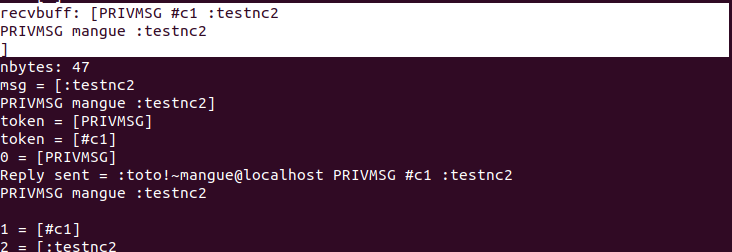
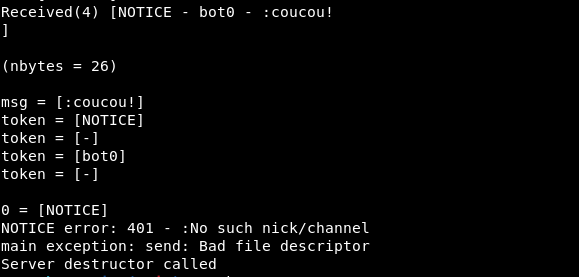
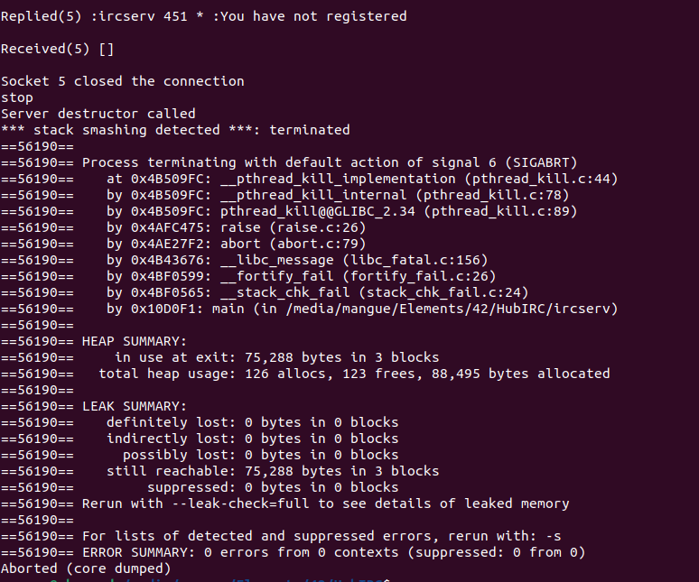

# HubIRC

https://github.com/marineks/Ft_irc?tab=readme-ov-file

Modern IRC Client Protocol
https://modern.ircdocs.horse/

Beej’s Guide to Network Programming - Using Internet Sockets
https://beej.us/guide/bgnet/pdf/bgnet_a4_c_1.pdf

IRC
https://chi.cs.uchicago.edu/chirc/irc.html

Introduction to Sockets Programming in C using TCP/IP
https://www.csd.uoc.gr/~hy556/material/tutorials/cs556-3rd-tutorial.pdf

